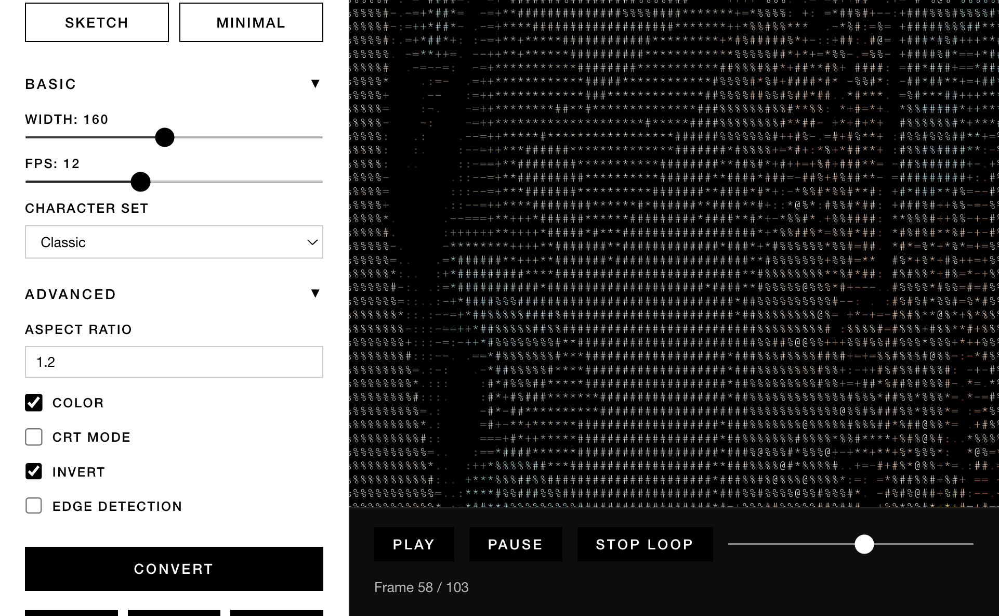

# video2ascii

Convert any video to ASCII art and play it in your terminal.


## Demo

```bash
# Classic ASCII
video2ascii your-video.mp4

# Retro CRT mode - 80 columns, green phosphor color
video2ascii your-video.mp4 --preset crt

# Commodore 64 mode - 40 columns, PETSCII, light blue on dark blue
video2ascii your-video.mp4 --preset c64

# Edge detection (sketch-like effect)
video2ascii your-video.mp4 --edge --invert

# Auto-generate subtitles from audio
video2ascii your-video.mp4 --subtitle
```

The tool extracts frames from the video, converts each to ASCII art using Pillow, and plays them back in sequence in your terminal.

## Web GUI

A browser-based interface is also available for easy video conversion without using the command line.



```bash
# Install web dependencies
uv pip install -e ".[web]"

# Launch the web GUI
video2ascii --web
```

Features:
- Drag-and-drop video upload
- Real-time conversion progress
- Presets (Classic, CRT, C64, Sketch, Minimal)
- Live playback with scrubbing
- Auto-generated subtitles
- Font chooser for PETSCII charset
- Export to .sh or .mp4

## Requirements

**System dependencies:**
- **ffmpeg** (for video frame extraction and video encoding)
  - macOS: `brew install ffmpeg`
  - Linux: `apt install ffmpeg` (or equivalent)

**Optional system dependencies:**
- **whisper-cli** (for auto-generated subtitles from audio)
  - macOS: `brew install whisper-cpp`
  - Requires a Whisper GGUF model (e.g. `ggml-large-v3-turbo.bin`)
  - Set `VIDEO2ASCII_WHISPER_MODEL` env var to your model path, or place it in `~/.cache/whisper/`
  - For accurate subtitle timing, also install the Silero VAD model (`ggml-silero-v5.1.2.bin`) in the same directory

**Python dependencies:**
- Python 3.10+
- Pillow (installed automatically)
- **[uv](https://github.com/astral-sh/uv)** (recommended) or pip/pipx

## Installation

### Option 1: Install with uv (recommended)

```bash
# Clone the repository
git clone https://github.com/funkatron/video2ascii.git
cd video2ascii

# Install uv if you don't have it
curl -LsSf https://astral.sh/uv/install.sh | sh

# Install the package
uv pip install .

# Or install in editable mode with dev dependencies
uv pip install -e ".[dev]"
```

### Option 2: Install with pip/pipx

```bash
# Clone the repository
git clone https://github.com/funkatron/video2ascii.git
cd video2ascii

# Install with pip
pip install .

# Or install with pipx (recommended for CLI tools)
pipx install .
```

### Option 3: Run directly (no install)

```bash
# Clone the repository
git clone https://github.com/funkatron/video2ascii.git
cd video2ascii

# Run directly with uv
uv run python -m video2ascii input.mp4

# Or run directly with Python
python3 -m video2ascii input.mp4
```

## Usage

```bash
# Basic usage (defaults: 160 width, 12 fps)
video2ascii input.mp4

# Custom width and framerate
video2ascii input.mp4 --width 120 --fps 15

# Enable color output
video2ascii input.mp4 --color

# Presets: CRT, C64, Sketch, Minimal
video2ascii input.mp4 --preset crt
video2ascii input.mp4 --preset c64
video2ascii input.mp4 --preset sketch

# --crt is shorthand for --preset crt (backward compatible)
video2ascii input.mp4 --crt

# Loop forever at 1.5x speed with progress bar
video2ascii input.mp4 --loop --speed 1.5 --progress

# Edge detection (sketch-like effect)
video2ascii input.mp4 --edge --invert --color

# Combine preset with loop and progress
video2ascii input.mp4 --preset crt --loop --progress

# Override preset values (preset sets defaults, flags override)
video2ascii input.mp4 --preset c64 --width 60

# Auto-generate subtitles from audio
video2ascii input.mp4 --subtitle --color

# Export as standalone playable file (no dependencies!)
video2ascii input.mp4 --export movie.sh
./movie.sh --loop --crt

# Export as MP4 with subtitles and a specific font
video2ascii input.mp4 --preset c64 --subtitle --font PetMe128 --export-mp4 ascii-video.mp4

# Export as ProRes 422 HQ (larger file size, suitable for video editing)
video2ascii input.mp4 --color --charset braille --export-prores422 ascii-prores.mov
```

### Options

| Option | Description | Default |
|--------|-------------|---------|
| `--web` | Launch browser-based web GUI (see [Web GUI](#web-gui)) | off |
| `--preset NAME` | Apply a preset: classic, crt, c64, sketch, minimal (see [Presets](#presets)) | - |
| `--width N` | ASCII output width in characters | 160 |
| `--fps N` | Frames per second to extract/play | 12 |
| `--color` | Enable ANSI color output | off |
| `--crt` | Shorthand for `--preset crt` | off |
| `--loop` | Loop playback forever | off |
| `--speed N` | Playback speed multiplier (0.5, 1.0, 2.0, etc.) | 1.0 |
| `--invert` | Invert brightness and colors (dark mode friendly) | off |
| `--edge` | Edge detection for sketch-like effect | off |
| `--edge-threshold N` | Edge detection threshold (0.0-1.0) | 0.15 |
| `--charset NAME` | Character set: classic, blocks, braille, dense, simple, petscii | classic |
| `--subtitle` | Auto-generate subtitles from audio (requires whisper-cli) | off |
| `--font NAME_OR_PATH` | Font for MP4/ProRes export (e.g. PetMe128, /path/to/font.ttf) | auto |
| `--aspect-ratio N` | Terminal character aspect ratio correction | 1.2 |
| `--progress` | Show progress bar during playback | off |
| `--export FILE` | Package as standalone playable script | - |
| `--export-mp4 FILE` | Export ASCII frames as MP4 video file (H.265/HEVC encoding) | - |
| `--export-prores422 FILE` | Export ASCII frames as video file using ProRes 422 HQ codec | - |
| `--no-cache` | Delete temp files after playback | keep |
| `-v, --verbose` | Enable verbose/debug logging | off |
| `-h, --help` | Show help message | - |

## Presets

Presets bundle conversion settings and an optional color scheme. Use `--preset NAME` to apply one. Explicit CLI flags (like `--width 60`) override preset defaults.

| Preset | Width | Charset | Color Scheme | Description |
|--------|-------|---------|--------------|-------------|
| `classic` | 160 | classic | none | Default — clean ASCII art |
| `crt` | 80 | classic | green phosphor (#33FF33 on #050505) | 1980s CRT terminal look |
| `c64` | 40 | petscii | light blue on dark blue (#7C70DA on #352879) | Commodore 64 boot screen |
| `sketch` | 160 | classic | none | Edge detection + invert for sketch effect |
| `minimal` | 120 | simple | none | Low-detail, clean output |

`--crt` is shorthand for `--preset crt` (backward compatible).

### CRT Preset

Simulates 1980s green phosphor terminal appearance:
- Fixed 80-column width
- Green tint applied to all text
- Dark background
- Enhanced contrast via unsharp filter

### C64 Preset

Simulates a booted Commodore 64:
- 40-column width (authentic C64 screen width)
- PETSCII character set (Unicode Legacy Computing block)
- Light blue text on dark blue background using the Pepto palette (widely considered most accurate for the VIC-II chip)
- For best results, install [KreativeKorp Pet Me fonts](https://www.kreativekorp.com/software/fonts/c64/) in your terminal

### Edge Detection (`--edge`)

Uses Sobel-based edge detection with Gaussian blur and thresholding to extract clean outlines from the video. Creates a sketch-like effect by highlighting edges and suppressing other details. Combine with `--invert` for improved contrast. Use `--edge-threshold` to control sensitivity (lower = more edges).

### Character Sets (`--charset`)

Character sets available:

- **`classic`** (default): Balanced traditional ASCII art (`" .:-=+*#%@"`)
- **`blocks`**: Bold Unicode block characters (`" ░▒▓█"`)
- **`braille`**: Braille characters (Unicode U+2800-U+28FF)
- **`dense`**: Many characters for fine gradients and detail
- **`simple`**: Minimal character set (`" .oO0"`)
- **`petscii`**: True Commodore 64 [PETSCII](https://en.wikipedia.org/wiki/PETSCII) graphics characters using Unicode 13.0+ Symbols for Legacy Computing block
  - For Commodore 64 appearance, use [KreativeKorp Pet Me fonts](https://www.kreativekorp.com/software/fonts/c64/) in your terminal
  - Variants: PetMe, PetMe64, PetMe128, PetMe2X, PetMe2Y, PetMe642Y, PetMe1282Y

You can also provide a custom character string ordered from darkest to lightest.

### Subtitles (`--subtitle`)

Auto-generates subtitles from the video's audio track:

- If the video already has an embedded subtitle stream (SRT/ASS/etc.), it is extracted and used directly
- Otherwise, audio is transcribed locally using [whisper-cli](https://github.com/ggerganov/whisper.cpp) (whisper.cpp)
- Voice Activity Detection (VAD) provides accurate start/end timestamps
- Subtitles display at the bottom of the frame in terminal playback, in the web GUI, and burned into MP4 exports

**Setup:**

1. Install whisper-cli: `brew install whisper-cpp` (macOS) or build from source
2. Download a Whisper GGUF model (e.g. `ggml-large-v3-turbo.bin`) to `~/.cache/whisper/`
3. Optionally download the Silero VAD model (`ggml-silero-v5.1.2.bin`) to the same directory for precise timing

**Environment variables:**

| Variable | Description |
|----------|-------------|
| `VIDEO2ASCII_WHISPER_CLI_PATH` | Path to `whisper-cli` binary (auto-detected if on `$PATH`) |
| `VIDEO2ASCII_WHISPER_MODEL` | Path to Whisper GGUF model file |
| `VIDEO2ASCII_VAD_MODEL` | Path to Silero VAD GGUF model file |

```bash
# Terminal playback with subtitles
video2ascii input.mp4 --subtitle --color

# Export MP4 with subtitles burned in
video2ascii input.mp4 --subtitle --color --export-mp4 output.mp4

# Export standalone script (subtitles embedded)
video2ascii input.mp4 --subtitle --export movie.sh
```

### Export Modes

#### Standalone Script (`--export FILE`)

Packages all ASCII frames into a **single, self-playing bash script**. The exported file:
- Has **zero dependencies** (just bash)
- Contains all frames embedded inline (compressed with gzip+base64)
- Supports `--loop`, `--speed`, `--crt`, `--progress` at playback
- Is portable and shareable

```bash
# Create a standalone ASCII movie
video2ascii video.mp4 --preset crt --export retro_movie.sh

# Share with friends - they just need bash!
./retro_movie.sh
./retro_movie.sh --loop --speed 1.5
```

Use cases:
- Sharing ASCII art animations
- Terminal screensavers
- Embedding in dotfiles or scripts
- Email attachments

#### MP4 Video (`--export-mp4 FILE`)

Renders ASCII frames as images and creates an MP4 video file:
- Renders ASCII art using system monospace fonts
- Preserves color information (if `--color` was used)
- Applies color scheme tint (CRT green, C64 blue, etc. from `--preset`)
- Burns subtitles into the video (if `--subtitle` was used)
- Creates MP4 file playable in any video player

**Codec Options:**

- `--export-mp4 FILE`: Uses H.265/HEVC encoding (default, better compression, smaller file size)
- `--export-prores422 FILE`: Uses ProRes 422 HQ encoding (larger file size, suitable for video editing)

**Font Selection:**

The `--font` flag lets you choose a specific font for MP4/ProRes export. This is especially useful for PETSCII mode where multiple PetMe font variants are available.

```bash
# Use a specific PetMe variant
video2ascii input.mp4 --charset petscii --font PetMe128 --export-mp4 output.mp4

# Use an absolute path to any font
video2ascii input.mp4 --font /path/to/MyFont.ttf --export-mp4 output.mp4
```

Without `--font`, fonts are auto-selected based on charset:
- **petscii**: PetMe64 (or first available PetMe variant)
- **braille**: Bold braille font preferred, then regular braille, then monospace
- **everything else**: Iosevka, VT323, IBM Plex Mono, Menlo, DejaVu Sans Mono, etc.

Subtitle burn-in uses a separate readable monospace font (Iosevka, IBM Plex Mono, Menlo, etc.).

```bash
# Export as MP4 (H.265/HEVC - default)
video2ascii video.mp4 --preset c64 --export-mp4 output.mp4

# Export as ProRes 422 HQ
video2ascii video.mp4 --color --charset braille --export-prores422 output-prores.mov

# With subtitles
video2ascii video.mp4 --color --subtitle --export-mp4 subtitled-ascii.mp4

# PETSCII with specific PetMe font
video2ascii video.mp4 --charset petscii --font PetMe128 --export-mp4 petscii-video.mp4
```

Use cases:
- Sharing on social media
- Embedding in websites
- Creating demos or presentations
- Archiving ASCII art animations

## Architecture

```
video2ascii/
├── cli.py              # CLI entry point (argparse, --preset/--crt flags)
├── converter.py        # Core: frame extraction (ffmpeg), ASCII conversion (Pillow), edge detection
├── presets.py          # Preset definitions: ColorScheme dataclass, PRESETS dict (single source of truth)
├── player.py           # Terminal playback engine (ANSI escape sequences, subtitle display)
├── exporter.py         # Standalone .sh script export (gzip+base64 compressed)
├── mp4_exporter.py     # MP4/ProRes video export (renders ASCII to images, encodes with ffmpeg)
├── fonts.py            # Font discovery and resolution (resolve_font, list_available_fonts)
├── subtitle.py         # Subtitle generation: embedded stream extraction, whisper-cli transcription, SRT parsing
├── web/
│   ├── app.py          # FastAPI backend: upload, convert, SSE progress, presets/fonts APIs, export
│   ├── renderer.py     # ANSI-to-HTML converter for web display
│   ├── server.py       # Standalone web server entry point
│   └── static/
│       └── index.html  # Single-page frontend (vanilla HTML/CSS/JS, font chooser)
tests/
├── test_cli.py         # CLI argument parsing and main function tests
├── test_converter.py   # Frame extraction, ASCII conversion, edge detection tests
├── test_exporter.py    # Shell script export tests
├── test_fonts.py       # Font discovery and resolution tests
├── test_presets.py     # Preset definitions, ColorScheme, serialization tests
├── test_mp4_exporter.py# MP4/ProRes export tests
├── test_player.py      # Terminal player tests
├── test_subtitle.py    # Subtitle generation, SRT parsing, whisper-cli integration tests
├── test_web_app.py     # FastAPI endpoint integration tests
└── test_web_renderer.py# ANSI-to-HTML renderer tests
```

## How It Works

1. **Frame Extraction**: Uses `ffmpeg` to extract frames at the specified FPS and scale them to the target width
2. **ASCII Conversion**: Uses Pillow to convert each frame to ASCII art (parallelized across CPU cores). Maps pixel brightness to character density ramp: `" .:-=+*#%@"`
3. **Subtitle Generation** (optional): Extracts embedded subtitle streams via ffprobe, or transcribes audio locally via whisper-cli with VAD for accurate timing
4. **Playback**: Displays frames sequentially in the terminal using ANSI escape sequences for smooth animation. Subtitles are displayed centered at the bottom of the frame.
5. **Web GUI**: FastAPI serves a single-page app; uploads go through multipart form, conversion runs in a thread pool, progress streams via Server-Sent Events (SSE), frames are rendered as colored HTML spans

## Tips

- **Presets**: Use `--preset crt` for green phosphor CRT, `--preset c64` for Commodore 64, `--preset sketch` for line art, `--preset minimal` for clean output.
- **CRT Preset**: Works best in a terminal with a dark background. Retro fonts like "VT323" or "IBM Plex Mono" can enhance the appearance.
- **C64 Preset**: Install [KreativeKorp Pet Me fonts](https://www.kreativekorp.com/software/fonts/c64/) for authentic Commodore 64 rendering. Available variants: PetMe, PetMe64, PetMe128, PetMe2X, PetMe2Y, PetMe642Y, PetMe1282Y.
- **PETSCII Charset**: You can use `--charset petscii` independently of presets, but the C64 preset bundles it with the right width and colors.
- **Subtitles**: For best results, use a high-quality Whisper model (`ggml-large-v3-turbo.bin`). The Silero VAD model improves timestamp accuracy significantly.
- **Width**: Presets set width automatically (CRT=80, C64=40). For modern displays, try 120-200 depending on your terminal size.
- **FPS**: Higher FPS = smoother playback but more processing. 10-15 FPS works well for most content.
- **Speed**: Use `--speed 0.5` for slow-mo, `--speed 2` for double-speed.
- **Edge + Color**: Combining edge detection with color preserves color information along detected edges.
- **Invert + Color**: When both are enabled, RGB values are inverted (negative effect). In grayscale mode, only the character mapping is reversed.
- **Aspect Ratio**: Terminal characters are roughly 2:1 height:width, so the tool automatically adjusts frame height for proper proportions.

## Development

This project uses `uv` for package management and development workflows.

```bash
# Install in editable mode with dev dependencies
uv pip install -e ".[dev]"

# Also install web dependencies for full development
uv pip install -e ".[web]"

# Run tests
uv run pytest

# Run tests with coverage
uv run pytest --cov=video2ascii

# Run the tool directly (CLI)
uv run python -m video2ascii input.mp4

# Run the web GUI directly
uv run python -m video2ascii.cli --web
```

### Dependency Groups

| Group | Install | Contents |
|-------|---------|----------|
| core | `uv pip install .` | Pillow |
| dev | `uv pip install -e ".[dev]"` | pytest, pytest-cov, pytest-mock, httpx |
| web | `uv pip install -e ".[web]"` | FastAPI, uvicorn, python-multipart |

### Entry Points

| Command | Module | Description |
|---------|--------|-------------|
| `video2ascii` | `video2ascii.cli:main` | CLI tool |
| `video2ascii-web` | `video2ascii.web.server:main` | Standalone web server |

The project also works with standard pip/pipx workflows if you prefer.

## Performance

The tool parallelizes frame conversion across all available CPU cores using Python's `multiprocessing`, making the processing phase significantly faster on multi-core systems.

Cached frames are stored in `/tmp/ascii_FILENAME.XXXXXX/` by default. Use `--no-cache` to clean up automatically, or manually delete the temp directory.

## Controls

- **Ctrl+C**: Stop playback and exit

## License

BSD 3-Clause
